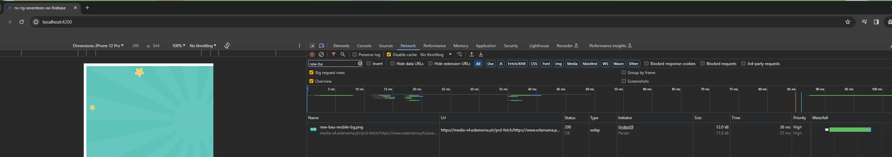
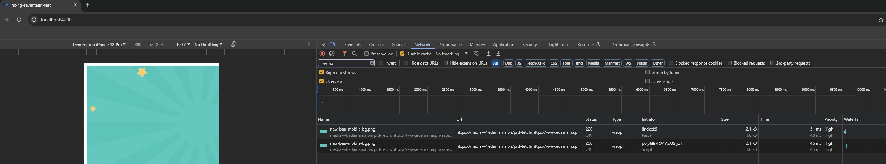

# NgOptimized Image Angular v17 double download reproduction

The double download is caused by weird CD issue when used with Angular Fire. I think the problem lies that `NgOptimizedImage` always sets the `src` even if the src and srcset is the same as the previous value which causes double download.

Uses latest Angular v17.0 code

## apps/nx-ng-seventeen-no-firebase

Contains an SSR app with no firebase configured.

To run:

```shell
npx nx run nx-ng-seventeen-no-firebase:serve:production
```

Output:

No double download of images upon load of HTML.



## apps/nx-ng-seventeen-test

Contains an SSR app with firebase configured.

Ensure that you have a firebase project that you can set credentials here apps/nx-ng-seventeen-test/src/app/app.config.ts

This is a minimal reproduction so config is left as blank for the investigator to hardcode it during investigation.

To run:

```shell
npx nx run nx-ng-seventeen-test:serve:production
```

Output:

Double download of images upon load of HTML. One from the preload created in SSR and one by first-party code. Try refreshing multiple times and you'll see that image is double downloaded most of the time


